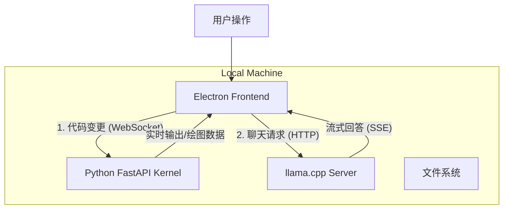

# DeepInsight AI Studio - 技术架构与实施规范

> 本文档基于《DeepInsight AI Studio —— 完整产品设计与实施方案》制定，明确了技术选型，并补充了架构实现的详细思考。

## 1. 核心技术栈决策 (Tech Stack Decisions)

针对原方案中不确定的技术点，经评估后确定如下选型：

### 1.1 桌面端框架：Electron
*   **决策**：使用 **Electron** (React + TypeScript)。
*   **理由**：
    *   **IDE 生态支持**：我们需要集成 Monaco Editor (VS Code 的核心编辑器) 和 Xterm.js (终端模拟)，这些在 Electron/Web 环境下有最成熟的绑定。
    *   **Node.js 能力**：Electron 的主进程（Main Process）能更方便地管理 Python 子进程的生命周期，且社区有大量现成的 `node-pty` 等库处理伪终端交互。
    *   **风险规避**：Tauri 虽然性能更好，但在处理复杂的 WebGL + 多窗口 + 本地子进程通信的混合场景下，Electron 的坑更少，开发效率更高。

### 1.2 渲染交互层：Three.js (@react-three/fiber)
*   **决策**：**Three.js** 配合 **React Three Fiber (R3F)**。
*   **理由**：
    *   **声明式编程**：R3F 允许我们像写 HTML 一样写 3D 场景，这对于管理复杂的交互状态（如“当视频播放到 00:15 时，显示矩阵变换动画”）至关重要。
    *   **视觉上限**：为了达成“赛博学术风”，我们需要大量的后处理效果（Bloom, Glitch），Three.js 在这方面有丰富的 Post-processing 库。D3.js 更适合 2D 数据图表，不适合沉浸式体验。

### 1.3 前后端通信：FastAPI + WebSocket
*   **决策**：**FastAPI** (Python) 运行在本地 localhost，通过 **WebSocket** 与 Electron 通信。
*   **理由**：
    *   **解耦**：将 Python 运行时设计为独立的本地 Server。这意味着未来如果需要，可以轻松将计算端迁移到云端，而前端代码几乎不用改。
    *   **实时性**：WebSocket 支持全双工通信，适合实时传输训练 Loss 曲线、终端输出流。
    *   **调试**：标准的 HTTP/WS 协议比 ZeroMQ 更容易调试，前端可直接用浏览器工具抓包。

### 1.4 本地 LLM 集成：llama.cpp (Server Mode) + Qwen-2.5-Coder
*   **决策**：内置 **llama.cpp** 可执行文件，启动为 OpenAI 兼容的 API Server。模型首选 **Qwen-2.5-Coder-7B-Instruct** (4bit 量化)。
*   **理由**：
    *   **编码能力**：Qwen-2.5-Coder 是目前小参数模型中代码能力最强的（超过 Llama 3.1 8B），且对中文支持极佳。
    *   **通用接口**：通过启动 llama.cpp server，前端只需使用标准的 OpenAI SDK 请求 `localhost:8080`，无需编写复杂的底层绑定代码。

---

## 2. 架构设计思考 (Architectural Insights)

### 2.1 "Lesson Protocol" (课程协议) —— 核心胶水层
软件的核心难点在于“视频”与“交互”的同步。我们需要定义一种 JSON 协议来描述这种关联：

```json
{
  "lesson_id": "linear_algebra_01",
  "timeline": [
    {
      "time_start": 15.5,
      "time_end": 45.0,
      "type": "video_segment",
      "src": "matrix_intro.mp4"
    },
    {
      "trigger_at": 45.0,
      "type": "interaction_checkpoint",
      "pause_video": true,
      "widget": "MatrixTransformation3D",
      "initial_state": { "matrix": [[1,0], [0,1]] },
      "goal": "Rotate the vector to [0, 1]",
      "code_template": "transform_matrix = np.array([[0, -1], [1, 0]])"
    }
  ]
}
```
*   **思考**：前端应该实现一个“时间轴控制器”，监听视频播放时间，自动触发 Interaction 组件的挂载和卸载。

### 2.2 Python 环境隔离方案：Project UV
原方案提到 Conda，但 Conda 体积过大且安装慢。
*   **新方案**：集成 **`uv`** (by astral)。
*   **流程**：
    1.  软件首次启动检测到无环境，自动下载 portable python。
    2.  使用 `uv venv` 毫秒级创建虚拟环境。
    3.  使用 `uv pip install` 快速安装 PyTorch 等依赖。
    *   *优势*：速度极快，且不需要用户预先安装 Python。

### 2.3 数据流向设计


---

## 3. 开发优先级 (Roadmap Adjustment)

基于技术确定的调整版路线图：

1.  **Phase 0: 骨架搭建 (Week 1-2)**
    *   Electron + React + Vite 脚手架。
    *   集成 Monaco Editor。
    *   实现 `uv` 自动环境初始化脚本。

2.  **Phase 1: 通信打通 (Week 3-4)**
    *   FastAPI Kernel 编写，实现 `exec_code` 接口。
    *   前端 Xterm.js 对接 Kernel 的 stdout/stderr。
    *   简单的 Matplotlib 图片 Base64 回传显示。

3.  **Phase 2: 可视化原型 (Week 5-8)**
    *   引入 Three.js。
    *   实现第一个“矩阵变换”Demo：左边改代码，右边 3D 箭头实时旋转。

4.  **Phase 3: 课程编排与 LLM (Week 9-12)**
    *   定义 Lesson Protocol。
    *   集成 llama.cpp。
    *   UI 美化（Cyberpunk 风格）。

## 4. 目录结构规范

```text
DeepInsight/
├── app/                  # Electron 主进程与渲染进程
│   ├── src/
│   │   ├── main/         # Electron Main
│   │   ├── renderer/     # React Frontend
│   │   │   ├── components/
│   │   │   │   ├── editor/    # Monaco
│   │   │   │   ├── visual/    # Three.js Canvas
│   │   │   │   └── terminal/  # Xterm
│   │   │   └── store/    # State Management
├── kernel/               # Python 后端
│   ├── main.py           # FastAPI 入口
│   ├── runtime/          # 代码执行沙箱
│   └── requirements.txt
├── assets/               # 静态资源
│   ├── models/           # 3D 模型
│   └── videos/           # Manim 预渲染视频
├── tools/                # 辅助工具
│   ├── llama/            # llama.cpp 二进制
│   └── uv/               # uv 包管理器
└── resources/            # 课程数据 (JSON + Scripts)
```
